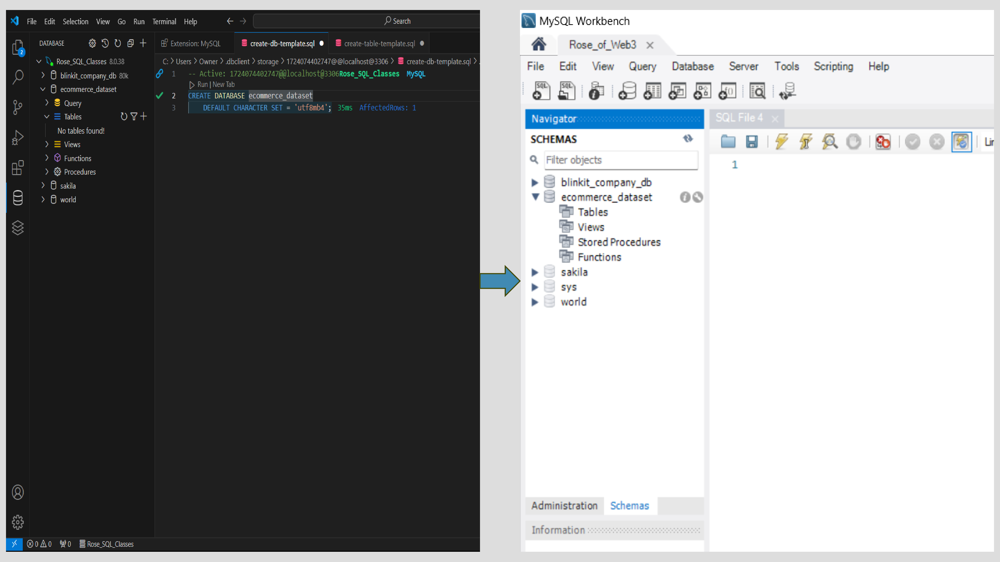
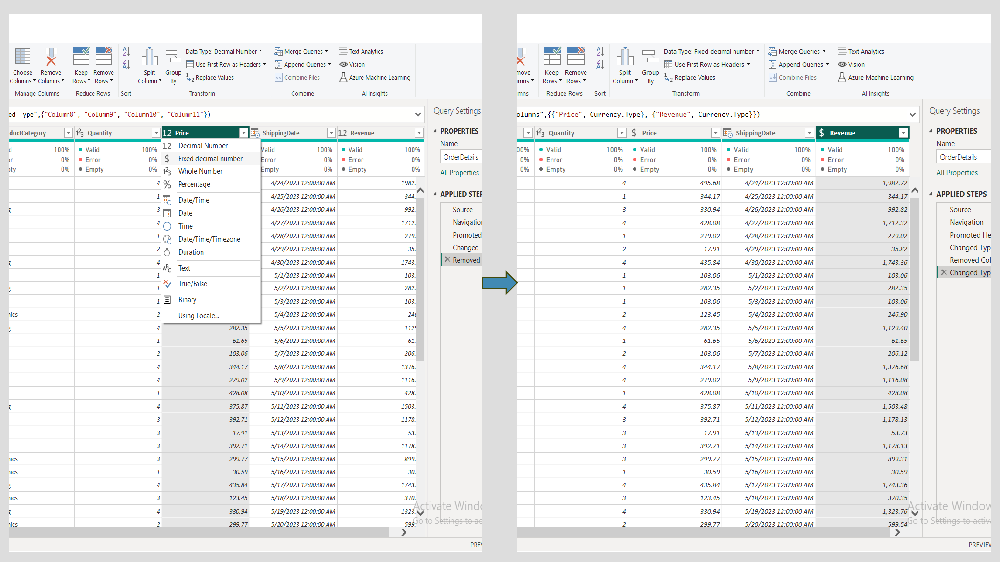

# Roseline_Project_Report

## E-commerce Project Report By Roseline Oderinde

## Tabble of Content
    Introduction
    Data Collection & Processing
        Excel
        MySQL
        Power BI
    Visualization
    Insights
    Predictions
    Recommendations
    Summary
    Conclusion

## Introduction
    E-commerce analytics is the collection and analysis of data to inform business decisions. It tracks metrics like sales, customer behavior, and Salesperson’s performance, providing insights to optimize marketing strategies, improve customer experience, and increase overall profitability.
    
## Data Collection & Processing
### Excel
    The dataset for this project was collected with the assistance of ChatGPT, following methods taught in class. The data file, structured as an Excel workbook, consists of four sheets: Customers, Products, Orders, and OrderDetails.
    
    Data Enhancement:
        Salespersons were added as a new column in the Orders sheet to provide a more comprehensive view of the sales process.

    Data Integration:
        The Products sheet contains key product attributes such as Category and Price. These attributes were dynamically incorporated into the OrderDetails sheet using the VLOOKUP function, ensuring data consistency and eliminating redundancy.
    
    Revenue Calculation:
        Revenue was computed in the OrderDetails sheet by applying a multiplication formula on the Price and Quantity columns, providing a clear metric for financial performance.

### MySQL
    The e-commerce dataset was managed using MySQL, leveraging Visual Studio Code alongside the MySQL extension to create and organize the database efficiently.
    
    Database Creation:
        A database named ecommerce_dataset was created to store and manage the data.

    Table Structuring:
        Four tables—Customers, Products, Orders, and OrderDetails—were designed and added to the database. Each table was structured with its respective columns to ensure proper organization and relational data integrity.

    Data Import:
        To facilitate real-world application, the ecommerce_dataset was first converted into CSV format.
        Using the Import Wizard in MySQL, the data from the Customers table was successfully imported into the database, demonstrating the practical workflow taught in class.

### Power BI
    Power BI was utilized to transform, model, and visualize the e-commerce dataset, enabling actionable insights through an intuitive dashboard.
    
    Data Import and Transformation:
        The e-commerce dataset was imported into Power BI using the Get Data tab.
        In the Power BI Query Editor, several transformations were performed: Data types for Price and Revenue were updated to Currency for consistency and clarity.
        Empty columns in the OrderDetails table were removed to ensure data cleanliness.

    Data Modeling:
        Once transformations were complete, the data was applied, and modeling was initiated using the Model View.
        The dataset's four tables (Customers, Products, Orders, and OrderDetails) were linked via three primary relationships: CustomerID, ProductID, and OrderID.

    Visualization and Insights:
        Using the Report View, various visualizations were created to uncover insights from the dataset:
        Power BI Charts and Slicers were employed to interactively explore key metrics.
        Key Performance Indicators (KPIs) were generated to track vital business metrics.
        The dashboard was formatted to present the data effectively, making it accessible and actionable.

## Visualization

## Insights
    Total Revenue: 
        $189.74K across 753 total items sold.
    Top Revenue-Generating Category:
        Sports: $58K.
        Clothing: $55K.
    Peak Revenue Month: 
        January ($32K); lowest revenue in December ($9K).
    Top Product by Revenue: 
        Product_10 ($27K), followed by Product_14 ($21K).
    Top Location: 
        New York ($52.06K, 27.44% of total revenue).
    Top Salesperson: 
        Bob Smith ($55K, 29% of total sales by quantity).
    Customer Segmentation: 
        Customer ID 45 contributes 25.87% of revenue.

## Predictions
    Seasonality: 
        December may experience consistently low sales; focus on promotional offers.
    Key Growth Opportunities: 
        Expanding sales of high-revenue products (e.g., Product_10) in lower-performing regions.
    Sales Team Impact: 
        Bob Smith likely to maintain top performance; incentivize others for competitive growth.
    Potential Market Growth: 
        Increasing focus on Electronics and Books can improve underperforming categories.
    
## Recommendations
    Marketing Strategy:
        Target peak performers like New York for high-budget campaigns.
        Promote Books and Home categories to balance revenue.
    Incentives: 
         Offer rewards to other sales team members (e.g., Catherine Lee) to reduce dependency on top performers.
    Product Strategy:
        Expand the availability of Product_10 in Houston and Phoenix for growth.
        Bundle low-performing products (e.g., Product_13) with high sellers.
    Customer Engagement:
        Focus retention campaigns on top customers (Customer ID 45, 97, 75).
        Introduce loyalty points for recurring purchases in December.

## Summary
    Revenue Concentration:
        Dominated by Sports and Clothing categories.
    Regional Leadership:
        New York remains a stronghold.
    Sales Dependence:
        Top salespeople drive a significant portion of revenue.
    Actionable Focus:
        Improving sales in low-performing categories, regions, and months can diversify income streams.
    
## Conclusion
    The e-commerce data collection and processing project showcased the practical application of data management and analysis tools—Excel, MySQL, and Power BI. 
    
    From data preparation and integration to modeling and visualization, each tool played a critical role in transforming raw data into actionable insights. 
    
    This comprehensive workflow highlights the importance of leveraging modern technologies for efficient data processing and informed decision-making in a real-world context.
    
    
    
    
    

